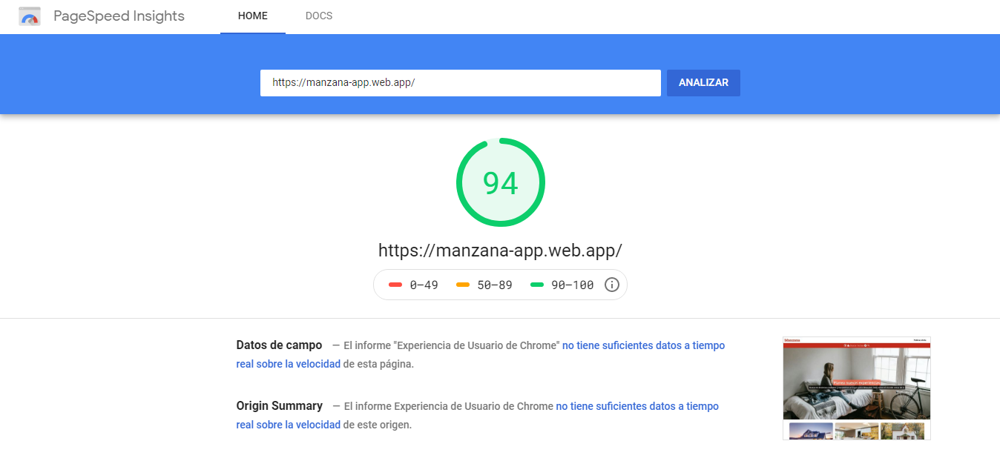

<h1 align="center">🍎 Manzana 🏡</h1>

<p align="center">La plataforma para adquirir espacios libres</p>
<p align="center">The platform to acquire free spaces</p>


<!-- Shields -->
<p align="center">
  <!-- Node -->
  
  <!-- React -->
  
  <!-- Material Icons -->
  
  <!-- Firebase -->
  
  <!-- React Date Range -->
  
</p>

## 🚀 Deployment
💻 Once you have cloned or directly downloaded this repository: Open a terminal, go to the project 
folder and run:

📦 Install the dependencies

```bash
npm install
```
📃 Start the development mode

```bash
npm start
```
🎉 **Great! Start using or developing in the Manzana project.**


## 🔨 Builded with
**Manzana** was builded using the npx tool `create-react-app`.

### 📅 Date Range
The functionality of selecting a date range to search for a free room or workspace is integrated using the react library `react-date-range`.

### ✋ UI Icons
The icon library is used for the user interface `@material-ui/icons`.

## ✍ Developers
People who contributed to the development and maintenance of the project.

* **[Marcelo Arias](https://github.com/360macky)** - `@360macky`

See also the list of [contributors](https://github.com/360macky/manzana/graphs/contributors) who participated in the project.


## 📃 License
Distributed under the MIT License.
See [`LICENSE`](./LICENSE) for more information.


## 🕖 Speed
The website was tested using **Google Pagespeed** with a score of **94** of 100:


